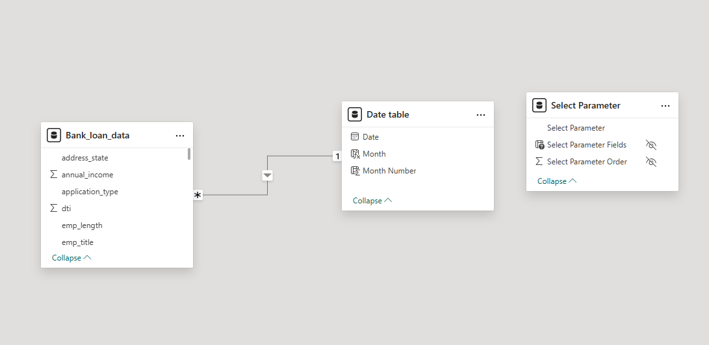

# Bank Loan Analysis Dashboard – SQL Server & Power BI

A complete project for analyzing U.S. bank loan performance using **SQL Server** and **Power BI**.  
The dashboard enables data-driven decision-making through deep insights into borrower behavior, loan performance, and financial metrics.

---

## 📌 Problem Statement

The current approach to loan data analysis lacks depth and interactivity, limiting the ability to derive meaningful insights. Traditional reporting fails to give a holistic view of borrower demographics, repayment performance, and regional trends.

---

## 🎯 Objective

To build a suite of dynamic and interactive dashboards that:
- Analyze loan applications, interest rates, and repayment patterns
- Segment loans by borrower type, location, employment, purpose, and term
- Compare monthly trends (MTD vs PMTD)
- Support strategic decision-making for stakeholders

---

## 🗂️ Project Structure

📁 SQL/ --> SQL queries for metrics, trends, and filters
📁 PowerBI/ --> Power BI dashboard file (.pbix)
📁 Documentation/ --> Problem statement, data model diagram

---

## 🛠️ Tools & Technologies

- SQL Server  
- Power BI  
- Microsoft Excel  

---

## 📊 Key Dashboard Features

- Total & Monthly Loan Applications
- Funded vs Received Amount (MTD, PMTD)
- Good vs Bad Loan % with Status Summary
- Reports by:
  - Term
  - Purpose
  - Employment Length
  - Home Ownership
  - State
- Drill-down filters with custom parameters

---

## 🧩 Data Model

---

## 🧠 SQL Highlights

- Window functions and aggregations
- Monthly performance tracking
- Conditional metrics: MTD, PMTD
- Loan status categorization (Good vs Bad Loans)

---

## 📁 Files

| File | Description |
|------|-------------|
| `SQLQuery_Of_This_Project.sql` | Raw SQL queries for building all dashboard metrics |
| `US_Bank_Loan_Dashboard.pbix` | Complete Power BI dashboard |
| `Problem_Statement.pdf` | Clear explanation of project scope and goal |
| `Data_Model_Screenshot.png` | Data relationships across model |

---

## 📎 Author

**Sunil Kumar**  
*Aspiring Data Analyst | SQL • Power BI • Excel*

---

